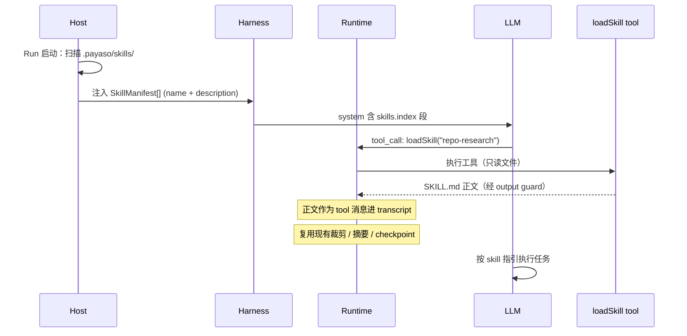

# PayasoAgent Harness Phase 2 — 重心切换方案

> **文档定位**：Runtime 已稳定可用，开发重心从 Runtime Kernel 切换到 Harness 控制层的路线图。以当前 `src/harness/` 代码为基线，借鉴 pi-agent 的 ResourceLoader / 三级 system 覆盖 / progressive disclosure 等设计，在不破坏 Runtime 语义的前提下向上"生长"控制能力。
>
> **版本锚点**：v2.0 Harness Phase 2（规划稿）
>
> **前置文档**：
>
> - `architecture-current.md` — 当前架构基线（v1.6 起），Runtime / Harness / Host 分层定义
> - `harness-boundary.md` — Runtime / Harness / Host 职责边界，本方案在其基础上扩展 Harness 侧
> - `runtime-kernel-freeze.md` — 已过时，仅作历史参考，其中"H 类留给 Harness"的清单本方案逐步落地

---

## 0. 背景与目标

### 0.1 现状

- **Runtime Kernel 已稳定**：Agent Loop、Side-Effect Safety、True Cancellation、Output Guard、Checkpoint/Resume 全部落地并通过确定性测试。
- **Harness 处于初期**：只有 Context Compaction V1（轮裁剪 + 增量摘要）和 4 段 system prompt 字符串拼接。
- **用户定制面缺失**：所有行为写死在代码里，用户无法通过声明式文件（system 覆盖、skills、prompts）扩展 Agent 行为。

### 0.2 目标

**将开发重心从 Runtime 切换到 Harness**，建立声明式控制层：

1. **System Prompt 模版化**：从硬编码字符串 → 有序段落注册表 → 文件覆盖
2. **Skills 渐进披露**：workspace 级 skill 声明 + 按需加载，不撑爆 context
3. **Prompt 命令**：声明式 prompt 模板 → 斜杠命令，降低重复输入成本
4. **不破坏 Runtime 语义**：所有改动落在 Harness / Host，Runtime 只做最小必要变更（最好零变更）

### 0.3 设计原则

| 原则 | 说明 |
|------|------|
| **声明优先** | 能用 Markdown/YAML 文件表达的，不写代码 |
| **渐进披露** | Skills 索引进 system、正文靠工具加载，不一次性灌全文 |
| **静态在前** | System prompt 段落按"静态 → 半静态 → 动态"排序，最大化上游 prompt cache 命中率 |
| **英文默认** | System prompt、SKILL.md、PROMPT.md 默认英文；用户消息与最终回复语言跟随用户 |
| **最小侵入** | Runtime 不改 agent loop 语义；新增能力走 Harness 端口注入 |
| **Fail-closed** | 新能力（文件加载、skill 执行）遇到异常一律降级，绝不提升权限或崩溃 |

---

## 1. 当前 Harness 基线

### 1.1 已有模块（7 个文件，约 835 行）

```
src/harness/
├── context-harness.ts         # AgentContextHarness 接口 + DefaultContextHarness
├── instructions.ts            # BASE_SYSTEM_PROMPT + 权限/网络/工具链动态段
├── context-manager.ts         # 轮边界裁剪 + 紧急兜底裁剪
├── model-context.ts           # 模型能力注册表 + token 估算
├── context-state.ts           # 可恢复的 summary 状态（随 checkpoint）
├── conversation-summarizer.ts # LLM 增量结构化摘要
└── scratchpad-view.ts         # Runtime scratchpad → 模型文本投影
```

### 1.2 现有 System Prompt 拼装（4 段字符串拼接）

```
BASE_SYSTEM_PROMPT
  + permissionSystemPrompt()      # read-only / workspace-write / full-access
  + toolchainSystemPrompt()       # 可用工具 + 缺失工具
  + networkSystemPrompt()         # on / off / ask
```

每轮由 `DefaultContextHarness.systemPromptText()` 重新拼装；网络段和工具链段支持运行中刷新（`refreshToolchain`、全局 network mode）。

### 1.3 已有扩展点

| 扩展点 | 类型 | 说明 |
|--------|------|------|
| `shouldStopAfterTurn` | 策略钩子 | Harness 在每轮工具完成后请求优雅停止（如预算耗尽） |
| `refreshToolchain` | 动态更新 | 受控安装完成后刷新工具链能力快照 |
| `sanitizeAssistantMessage` | 输出清理 | 剥离 `<think>` 标签等 |
| `sanitizeFinalAnswer` | 输出清理 | 最终答案后处理 |
| `harnessState` | 状态恢复 | summary 状态随 checkpoint 存/恢 |

### 1.4 已知缺口（本方案解决）

| # | 缺口 | 影响 |
|---|------|------|
| G-1 | System prompt 硬编码，无段落概念 | 加新指令只能改代码；无法按优先级/预算管理 |
| G-2 | 无项目级指令文件 | 用户不能通过 WORKSPACE.md / PAYASO.md 定制行为 |
| G-3 | 无 Skill 系统 | 可复用的操作流程只能写进 system prompt 或让模型重新摸索 |
| G-4 | 无 Prompt 命令 | 常用任务每次要手打完整指令 |
| G-5 | 模型行为适配只能靠 BASE_PROMPT | reasoning 吞答案等模型差异没有模型级 prompt 段 |
| G-6 | 无统一资源入口 | 指令/技能/提示散落在代码各处，没有 ResourceLoader 概念 |

---

## 2. 总体架构

### 2.1 分层视图

```
┌─────────────────────────────────────────────────────┐
│ Host (资源发现 + 授权 + 持久化)                       │
│  PAYASO.md · .payaso/skills/ · .payaso/prompts/       │
│  （Run 启动时快照，运行中不变）                          │
└───────────────┬─────────────────────────────────────┘
                │ 注入 SkillManifest[] + 指令文本
┌───────────────▼─────────────────────────────────────┐
│ Harness (拼装 + 预算 + 模型视图)                       │
│  InstructionComposer · SkillIndex · PromptRegistry   │
│  ContextManager · Summarizer · ScratchpadView        │
└───────────────┬─────────────────────────────────────┘
                │ prepareTurn / 单条 system message
┌───────────────▼─────────────────────────────────────┐
│ Runtime (稳定，核心语义不变)                           │
│  agent loop · side-effect · cancellation · checkpoint│
└─────────────────────────────────────────────────────┘
```

### 2.2 与 pi-agent 的对应关系

| pi-agent 概念 | 本方案对应 | 简化说明 |
|---------------|-----------|---------|
| `ResourceLoader` | Host 侧资源发现 + Harness 侧注册表 | 不分两层，发现和注入分开（Host 发现，Harness 消费） |
| `SYSTEM.md` 整体替换 | **不做** | 风险太高，先从追加/注入开始 |
| `APPEND_SYSTEM.md` | PAYASO.md（`<project_instructions>` 段） | 注入项目上下文，不替换内核 |
| `AGENTS.md` / `CLAUDE.md` | PAYASO.md | 单一入口，不做多文件兼容 |
| `skills/*/SKILL.md` | `.payaso/skills/<name>/SKILL.md` | 格式一致，渐进披露方式一致 |
| `.pi/prompts/*.md` → `/cmd` | `.payaso/prompts/*.md` → `/cmd` | 一致，参数插值语法一致 |
| Extensions (TS 插件) | **不做** | 扩展方式 = 写 skill + 注册工具 |
| Project Trust | Permission 门简化版 | read-only 模式下不加载 workspace 级指令/skills |

---

## 3. System Prompt 段落化（Step 1）

### 3.1 段落注册表

将现有字符串拼接升级为有序段落对象数组。每段带元数据。

```typescript
interface SystemSegment {
  id: string;              // 唯一标识，如 'kernel.base'
  priority: number;        // 排序权重，越小越靠前
  content: string;         // 段正文（英文）
  budgetTokens: number;    // 硬预算，超限则本段截断
  mutability: 'static' | 'per_run' | 'dynamic';
}
```

### 3.2 段清单（按 priority 排序）

| # | id | 来源 | budget | mutability | 说明 |
|---|----|------|--------|-----------|------|
| 1 | `kernel.base` | `BASE_SYSTEM_PROMPT` | 512 | static | 身份与核心规则 |
| 2 | `model.adaptation` | `MODEL_CAPABILITIES[].promptNotes` | 256 | static | 模型行为适配（如"content 不能为空"） |
| 3 | `project.instructions` | PAYASO.md 内容（Step 2 引入） | 8192 | per_run | 项目级指令，XML 包裹 |
| 4 | `skills.index` | Skill 索引（Step 3 引入） | 2048 | per_run | name + description 一行一个 |
| 5 | `platform.permission` | `permissionSystemPrompt()` | 128 | per_run | 文件系统权限说明 |
| 6 | `platform.toolchain` | `toolchainSystemPrompt()` | 256 | dynamic | 受控工具链状态 |
| 7 | `platform.network` | `networkSystemPrompt()` | 128 | dynamic | 网络权限状态 |
| 8 | `env.context` | 日期/OS/workspace 名（新增） | 64 | dynamic | 环境上下文 |

排序原则：**静态段在前（prompt cache 友好），动态段在后**。

### 3.3 InstructionComposer

新增 `src/harness/instruction-composer.ts`：

- **`addSegment(seg)`**：注册一段
- **`updateSegment(id, content)`**：更新动态段内容（用于网络/工具链运行时刷新）
- **`compose(maxTokens): string`**：按 priority 排序 + 预算截断，组装成单条 system 字符串
- **`diagnostics(): SegmentDiagnostic[]`**：返回各段预算使用情况、是否被截断

`compose()` 规则：
1. 按 priority 升序排列
2. 每段先自截断（超 `budgetTokens` 则尾部加 `…[truncated]`）
3. 累计超总预算 → 从最低 priority 段开始整段丢弃，直到 fit
4. 输出仍有最小保障：`kernel.base` 绝不丢弃（宁超预算也保留）

### 3.4 模型适配段（顺带修 bug）

在 `MODEL_CAPABILITIES` 加 `promptNotes` 字段：

```typescript
{
  pattern: /^MiniMax-M3$/i,
  contextWindowTokens: 512_000,
  maxOutputTokens: 16_384,
  promptNotes:
    'The final answer MUST be written to the content field. ' +
    'Reasoning is for thinking only. ' +
    'Empty content = task failure.',
}
```

这是"reasoning 吞答案 → result_len=0"bug 的 prompt 层修复；Runtime 层仍需加兜底（空 content + 非空 reasoning → 重试一次），两层防御。

---

## 4. 项目级指令文件 PAYASO.md（Step 2）

### 4.1 文件位置与格式

- **位置**：workspace 根目录 `PAYASO.md`
- **格式**：纯 Markdown，无 frontmatter
- **语言**：默认英文（用户可写中文，模型能理解即可）

### 4.2 注入方式

```
<project_instructions>
（PAYASO.md 全文，按 budget 截断）
</project_instructions>
```

作为 `project.instructions` 段落进入 system prompt（priority 3）。

### 4.3 安全门（简化版 Trust）

| permission mode | 是否加载 PAYASO.md | 理由 |
|-----------------|---------------------|------|
| `read-only` | 不加载 | 工作区文件不可信，不注入指令 |
| `workspace-write` | 加载 | 用户已授权写工作区，可视为隐式信任 |
| `full-access` | 加载 | 同左 |

比 pi-agent 的独立 trust 模型简单，但够用。后续可独立扩展。

### 4.4 Host 侧职责

- Run 启动时读取 `PAYASO.md`（若存在且权限允许）
- 快照注入 `AgentExecutionContext`
- 运行中不重新读取（保持 per_run 语义）

### 4.5 不做的

- `.payaso/SYSTEM.md` 整体替换 — 风险高，先从追加开始
- `.payaso/APPEND.md` 追加 — 先有一个入口，多入口后续再加
- 多级合并（子目录覆盖） — 单文件起步，够用就好

---

## 5. Skills 渐进披露（Step 3）

### 5.1 目录结构

```
<workspace>/.payaso/skills/<skill-name>/SKILL.md
```

### 5.2 SKILL.md 格式（全英文）

```markdown
---
name: repo-research
description: Standard flow for researching recent repo changes
version: 1.0
---

## When to use
When the user asks about recent changes / updates / modifications.

## Steps
1. Run `git log --oneline -20` to see recent commits
2. Read `docs/architecture-current.md` for the baseline
3. Check key source directories for new modules
4. Summarize findings

## Guidelines
- Focus on the last 20 commits
- Always cross-reference with architecture docs
- Cite specific files and commit hashes
```

规则：
- `name`：小写字母 + 连字符，唯一
- `description`：≤ 1024 字符，一句话说明用途
- `version`：可选，语义化版本
- 未知 frontmatter 字段：忽略（fail-closed）
- 正文：Markdown，建议 ≤ 32KB（走现有 output guard 16KB 截断）

### 5.3 加载流程



### 5.4 关键设计

| 设计点 | 选择 | 理由 |
|--------|------|------|
| Skill 正文注入位置 | tool 消息（不是 system） | 复用 transcript 全套机制：裁剪、摘要、output guard、checkpoint |
| 重复加载去重 | 现有 `operationIdentity` 机制 | 不新增状态；同 name 的 loadSkill 被视为幂等 |
| Checkpoint 覆盖 | 天然覆盖（正文在 transcript 里） | harnessState 不需要扩展 |
| 工具名 | `loadSkill` | 只读，由 Bootstrap 注册 |
| 全局 skills（`~/.payaso/skills/`） | Step 3 不做，v2 考虑 | 先做 workspace 级 |
| `disable-model-invocation` 标记 | 不做 | 先让模型都能主动加载 |

### 5.5 skills.index 段格式（system 内）

```
## Available Skills

Use the `loadSkill` tool to load the full skill content.

- repo-research: Standard flow for researching recent repo changes
- code-review: Structured code review checklist for PRs
- test-writer: Generate test cases from code patterns
```

单行 name+description 格式，token 开销最小。

---

## 6. Prompt 命令（Step 4）

### 6.1 目录结构

```
<workspace>/.payaso/prompts/<cmd-name>.md
```

示例：
```
.payaso/prompts/review.md    →   /review
.payaso/prompts/test.md      →   /test
.payaso/prompts/summary.md   →   /summary
```

### 6.2 Prompt 格式（全英文）

```markdown
---
name: review
description: Perform a structured code review
---

Please review the following code for:
1. Correctness and edge cases
2. Performance implications
3. Security concerns
4. Code style and readability

$@
```

### 6.3 参数插值

支持三种语法（和 pi-agent 一致）：

| 语法 | 含义 |
|------|------|
| `$1`, `$2`, ... | 第 n 个参数 |
| `$@` | 所有参数（空格连接） |
| `${1:-default}` | 第 1 个参数，缺省值为 default |

### 6.4 执行流程

1. Host 启动时扫描 `.payaso/prompts/`，构建命令注册表
2. 前端从 API 获取命令列表，在输入框提供自动补全
3. 用户输入 `/review file.ts bug` → Host / Harness 展开为完整 user 消息
4. 展开后的消息正常进入 transcript 和 Runtime loop

### 6.5 未匹配降级

- `/unknown` → 作为普通 user 消息处理（不报错）
- 参数不足 → 空字符串填入，不做强制校验（模型自会处理）

---

## 7. 实施路线

| Step | 名称 | 新增 | 修改 | 测试 | 规模 |
|------|------|------|------|------|------|
| **1** | InstructionComposer 段落化 | `instruction-composer.ts` | `context-harness.ts` / `instructions.ts` / `model-context.ts` | 段落排序 / 预算截断 / 模型适配段 | 小 |
| **2** | PAYASO.md 注入 | — | `host/`（读取） / `context-harness.ts`（段注入） | 读取 / 权限门 / 截断 | 小 |
| **3** | Skills 系统 | Host skills 发现模块 / `loadSkill` 工具 | `bootstrap/`（注册工具） / `context-harness.ts`（索引段） | 发现 / 去重 / 加载 / 幂等 | 中 |
| **4** | Prompt 命令 | Host prompts 注册表 / 参数插值器 | `host/routes.ts`（命令 API） / `context-harness.ts`（展开） | 插值语法 / 未匹配降级 | 中 |

### 7.1 Step 依赖

```
Step 1 (段落化)
  └─ Step 2 (PAYASO.md)  ← 依赖 Composer 的段注入接口
       └─ Step 3 (Skills)  ← 依赖 Composer 的 skills.index 段
            └─ Step 4 (Prompts) ← 独立，可与 Step 3 并行
```

Step 1 是地基，必须先做。Step 2/3/4 价值独立，可按优先级安排。

---

## 8. 风险与注意事项

| # | 风险 | 缓解 |
|---|------|------|
| R-1 | System prompt 膨胀导致 context 预算紧张 | Composer 预算截断 + 段优先级丢弃；kernel.base 永不丢 |
| R-2 | PAYASO.md / SKILL.md 注入恶意指令 | read-only 模式不加载；内容按数据对待，永不执行；运行在 sandbox 内 |
| R-3 | Token 估算偏差 | 现有 `estimateTextTokens` 偏保守（中文按 1 token/字），够用；不追求精确 |
| R-4 | Prompt cache 命中率下降 | 段排序保证静态段在前；动态段内容尽量稳定（相同状态字节一致） |
| R-5 | 文档漂移 | `architecture-current.md` / `harness-boundary.md` 同步更新；docs-contract 测试卡住不改文档的 PR |
| R-6 | Skill 滥用导致行为不可控 | Skill 正文在 tool 消息里，受裁剪/摘要控制；不进 system 核心区 |
| R-7 | 向后兼容 | 新能力默认关闭（无文件则无行为变化）；现有 `BASE_SYSTEM_PROMPT` 完整保留 |

---

## 9. 明确非目标（本阶段不做）

- **TS Extensions 插件系统**：扩展方式 = 注册工具 + 写 skill
- **全局 `~/.payaso/` 目录**：先做 workspace 级
- **SYSTEM.md 整体替换**：先从追加/注入开始，风险可控后再开放
- **Worktree 防重复加载**：单 workspace 模型，不需要
- **Themes / 主题包**：Web UI 深色模式已够用
- **MCP / 外部工具协议**：工具注册仍走代码模块，skill 只做指令层扩展
- **多 Provider 自动路由 / 故障转移**：手动选择已支持，自动路由属下一阶段
- **Memory / RAG / 长期记忆**：conversation summary 已覆盖短期记忆；长期记忆属下一阶段

---

## 10. 文档维护

- 本文件作为 **Harness Phase 2 规划**，实施过程中更新"实施状态"小节
- 每个 Step 完成后，更新 `architecture-current.md` 对应章节
- Step 3 完成后，更新 `harness-boundary.md` 的 Harness 职责列表
- 版本锚点随 Step 推进递增：Step 1 → v2.1，Step 2 → v2.2，依此类推
