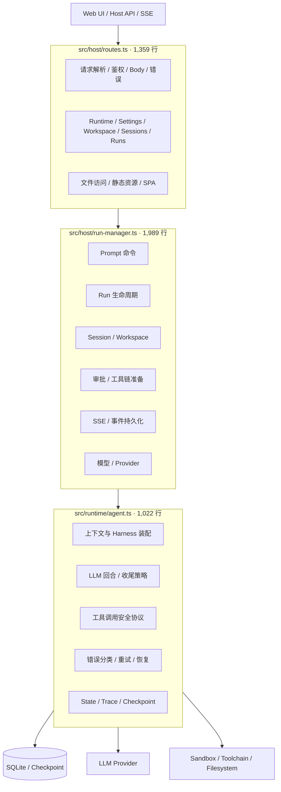
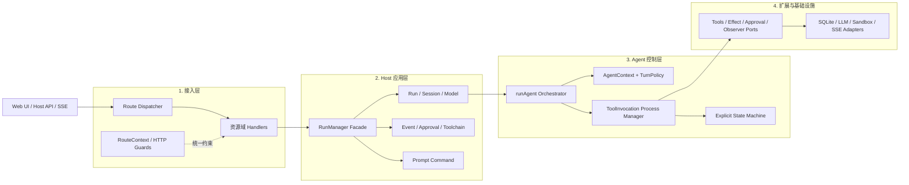
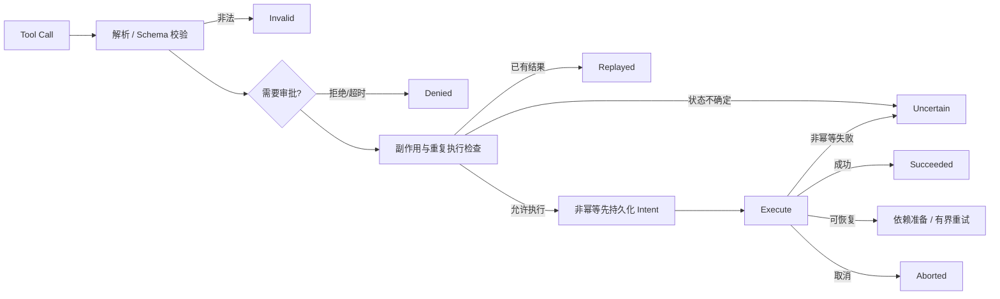

# 大文件职责拆分方案

> 范围：`src/host/run-manager.ts`、`src/host/routes.ts`、`src/runtime/agent.ts`  
> 原则：只拆职责，不改外部接口、运行语义和安全顺序。

## 1. 现状



问题：三个入口同时承担分发、业务规则、安全规则和基础设施适配，修改面过大。

## 2. 拆分后



## 3. 核心拆分

### Routes

| 模块 | 职责 |
| --- | --- |
| `routes.ts` | 只保留入口、资源域分发和静态兜底 |
| `routes/route-context.ts` | 统一鉴权、Body、响应和错误 |
| `routes/*-handler.ts` | Runtime、Settings、Workspace、Sessions、Runs 各自处理 |
| `routes/static-handler.ts` | 静态资源和 SPA fallback |

### RunManager

`RunManager` 保留现有公开 API，内部改为组合服务，不使用继承或 Mixin。

| 服务 | 职责 |
| --- | --- |
| `RunLifecycleService` | create、resume、stop、finalize、资源回收 |
| `SessionService` | Session CRUD、compact、export、goal、plan |
| `ModelService` | Provider、默认模型、模型配置解析 |
| `EventStreamService` | 事件序号、持久化、SSE 回放与推送 |
| `ApprovalCoordinator` | 网络审批、超时、取消 |
| `ToolchainPreparationCoordinator` | 安装审批、共享安装、能力刷新 |
| `PromptCommandRegistry` | Prompt 文件扫描；文本解析另放纯函数模块 |

### Agent Runtime

| 模块 | 职责 |
| --- | --- |
| `agent.ts` | 保留 `runAgent()` 主循环 |
| `agent-context.ts` | State、Harness、Scratchpad、Trace、Checkpoint 装配 |
| `turn-policy.ts` | 空回合、未完成收尾、停止决策 |
| `tool-invocation/process-manager.ts` | 工具调用协调与副作用执行 |
| `tool-invocation/state-machine.ts` | 调用阶段、合法转换与封闭终态 |

工具调用采用 **Durable Process Manager + Explicit State Machine**：



这不是开放 Pipeline。工具、审批、依赖准备和观测器可以扩展，但授权、Intent、执行、结果校验、Checkpoint 和 Abort 的顺序保持封闭。

## 4. 实施顺序

1. **基线**：补齐关键顺序测试，运行类型检查、lint 和完整测试。 ✅
2. **Routes**：先提公共约束，再逐个迁移资源域 handler。 ✅
3. **RunManager 外围服务**：依次拆 Model、Session、Event、Approval、Toolchain、Prompt。 ✅
4. **Run 生命周期**：最后从 RunManager 提取 create/resume/stop/finalize。 ✅
5. **Agent**：先拆 Context 和 TurnPolicy，最后提取 ToolInvocationProcessManager。 ✅
6. **收尾**：检查循环依赖、删除重复逻辑、更新架构文档。 ✅

每一步单独提交；测试失败时不进入下一步。实施提交记录：

| 提交 | 内容 |
| --- | --- |
| `08e33b6` | 拆分 routes.ts 为分发骨架 + 资源域 handler |
| `e5a8124` | 拆出 PromptCommand 纯函数模块与 ModelService 组合服务 |
| `3ae69c6` | 拆出 EventStreamService 组合服务 |
| `c1c7704` | 完成 run-types/run-views 抽取（视图投影纯函数化） |
| `2bfac94` | 拆出 SessionService 组合服务 |
| `a6c1809` | 拆出 ApprovalCoordinator 组合服务 |
| `b784a04` | 拆出 ToolchainPreparationCoordinator 组合服务 |
| `92b2702` | RunManager 门面化，拆出 RunLifecycleService |
| `4f4ef73` | 拆出 AgentContext 装配模块 |
| `b56dee0` | 拆出 TurnPolicy 纯函数模块 |
| `0f939f2` | 拆出 ToolInvocationProcessManager |

完成时的规模：`routes.ts` 1,359 → 63 行；`run-manager.ts` 1,989 → 407 行；`agent.ts` 1,022 → 452 行。三个入口只保留分发骨架、门面与主循环；每类可变状态（活跃 Run 容器、会话元数据、批准请求、工具链安装合并表）有唯一 owner；无新增循环依赖。

## 5. 不变量与验收

拆分过程中必须保持：

- `handleRequest`、`RunManager`、`runAgent` 的公开路径和签名兼容。
- HTTP 路径、鉴权、请求限制、响应结构和状态码不变。
- Run / Session 状态转换和 SQLite / Checkpoint 数据兼容。
- SSE 事件序号、持久化、历史回放和 live 推送顺序不变。
- 网络审批保持 fail-closed，工具链安装仍需用户明确批准。
- 非幂等操作先持久化 Intent；失败进入 `uncertain`，不得自动重试。
- Tool result 经过 normalize、validate、output guard 后才写回模型。
- Abort 保存现场并维持原有 stopped 语义。
- Runtime 不依赖 Host；Service 不反向依赖 RunManager Facade。

每阶段验收：

```bash
npx tsc --noEmit
npm run lint
npm run test:all
git diff --check
```

完成标准：三个入口只保留分发、门面或主循环；每类可变状态有唯一 owner；没有 Mixin、Service Locator、重复业务规则和新增循环依赖。
