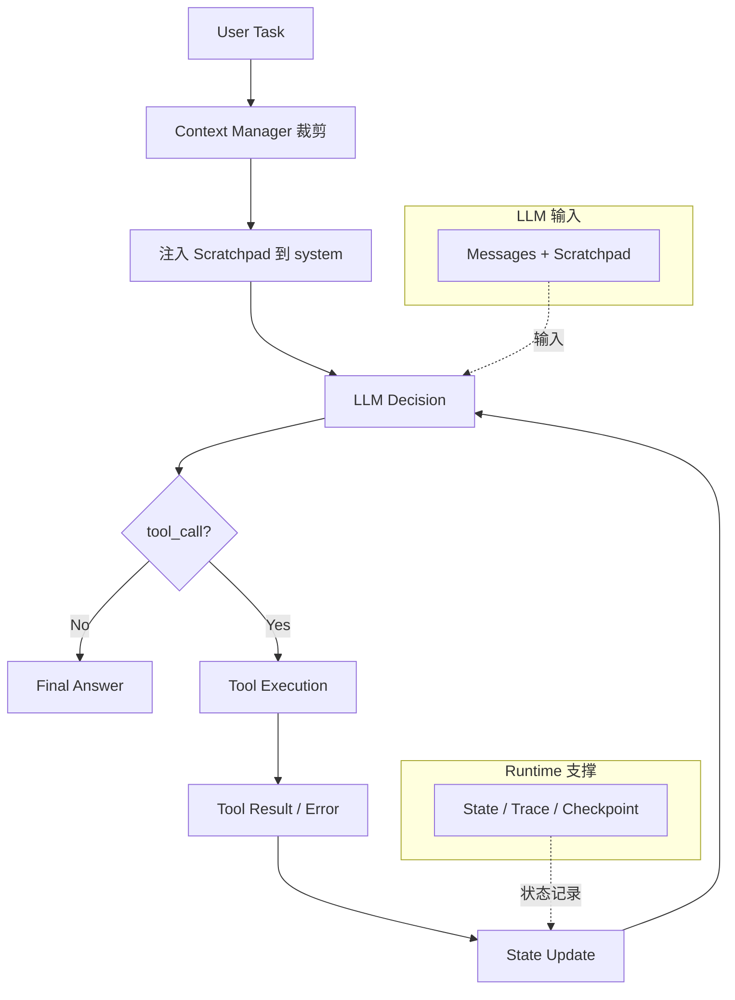

# PayasoAgent v1.0 设计文档

> Agent Runtime 技术设计文档 · 9 模块 · 1201 行 · 零第三方运行时依赖（仅 devDeps: typescript / tsx / @types/node）

---

## 设计目标

PayasoAgent v1.0 **不是一个完整 Agent Framework**，而是从最小 Agent Loop 演进出的 **Runtime 骨架**。

它回答的核心问题是：一个简单的 `while-loop`（LLM 判断 → 执行工具 → 回传结果）如何通过引入 State、Scratchpad、Recovery、Context、Checkpoint，成长为具备状态管理、失败恢复、上下文控制、中断恢复能力的可靠 Agent 运行时。

**核心验证命题**：

1. **工具驱动**：LLM 是否能够驱动工具执行
2. **状态维护**：Agent 是否能够维护任务状态
3. **失败恢复**：Agent 是否能够从工具失败中恢复
4. **上下文裁剪**：Agent 是否能够在 Context 裁剪后继续执行
5. **中断恢复**：Agent 是否能够在进程中断后恢复任务

**设计原则**：目标不是堆叠 Agent 能力，而是理解 **Agent Runtime 如何形成**——每个机制解决一个真实问题，机制之间有明确的职责边界。

---

## 1. 项目定位

### 1.1 演进路线（按实现顺序）

1. 最小 Loop（llm/tools/agent 三模块）
2. LLM 决策日志
3. 结构化执行轨迹 Trace
4. 执行状态 State
5. 每步实时输出
6. 工具错误处理 + 重试
7. 工具错误恢复（重试耗尽回传 LLM 决策）
8. 工具调用统计修正
9. 最小上下文管理 ContextManager
10. 短期执行进度 Scratchpad（结构化 + nextStep 语义）
11. 失败恢复 + 防死循环（pendingAction / lastToolError / failedSteps / Blocked）
12. 最小 Checkpoint（JSON 落盘 + --resume 恢复）
13. 能力测试集（10 任务端到端）

### 1.2 v1.0 边界（刻意不做）

- 不引入 Memory / Session / Multi-Agent / Harness / Planner
- 无数据库，无持久化框架（Checkpoint 用本地 JSON 文件）
- 不处理 LLM 调用层重试（网络抖动会直接 failed，见 §9 已知限制）

---

## 2. 架构总览

### 2.1 核心执行流程



**执行模型**：LLM 负责**决策**（是否调用工具、下一步动作），Runtime 负责**控制**（状态维护、工具执行、错误恢复、生命周期管理）。二者构成 `LLM Decision + Runtime Control` 的执行模型。

### 2.2 模块清单

| 分类 | 文件 | 行数 | 职责 |
|---|---|---|---|
| **Agent Runtime Core** | `src/agent.ts` | 374 | Agent Loop 驱动、任务执行、`--resume` 入口 |
| **Runtime State** | `src/state.ts` | 82 | 执行状态：status/iteration/currentStep/工具统计/pendingAction/lastToolError |
| | `src/scratchpad.ts` | 143 | 工作记忆：completedSteps[] + failedSteps[] + nextStep，注入 system 防裁剪丢失 |
| | `src/trace.ts` | 158 | 事件轨迹：10 种事件类型 + createTrace/addEvent/printEvent/printTrace |
| **Context & Persistence** | `src/context.ts` | 86 | 上下文裁剪：字符数估计 + 按轮裁剪（保留 system/最新 user/最近轮） |
| | `src/checkpoint.ts` | 55 | 状态保存恢复：本地 JSON（.checkpoints/{runId}.json） |
| **Model & Tool Layer** | `src/llm.ts` | 67 | LLM 调用：OpenAI 兼容 `/chat/completions`，支持 tools/function calling，纯 fetch 无 SDK |
| | `src/tools.ts` | 66 | Tool 注册与执行：`register`/`execute`/`getSchemas` + calculator 示例工具（失败抛异常） |
| **Evaluation** | `src/test.ts` | 170 | 端到端能力验证：子进程跑 10 个真实任务，断言输出，汇总 PASS/FAIL |

---

## 3. Agent Loop：循环决策引擎

### 3.1 核心流程

```
用户任务
  → [ContextManager 裁剪 messages]
  → [注入 Scratchpad 到 system]
  → LLM 判断（带 tools schemas）
      ├─ 无 tool_calls → 最终答案 → State=completed → 结束
      └─ 有 tool_calls → 对每个调用:
            ├─ isBlocked? → Blocked 拒绝，回传 LLM 重新决策
            ├─ 执行工具（重试 ≤2 次）
            │     ├─ 成功 → Scratchpad.completedSteps+1 → 结果回传 → 继续循环
            │     └─ 失败×3 → 错误回传 LLM → recovery_decision
            └─ 每步: State 摘要 + Trace 事件 + Checkpoint 落盘
```

关键常量：`MAX_ITERATIONS=10`（防死循环上限）、`MAX_RETRY=2`（工具重试，总尝试 3 次）、`MAX_CONTEXT_TOKENS=600`（**当前临时值**，生产应为 4000，见 §8）。

### 3.2 Loop 的本质

Agent Loop 将执行权划分为两层：

| 层 | 职责 |
|---|---|
| **LLM Decision** | 是否调用工具、下一步动作、何时输出最终答案 |
| **Runtime Control** | 状态维护、工具执行、错误恢复、生命周期管理（迭代上限/重试上限） |

Agent = LLM Decision + Runtime Loop + Tools。LLM 是**决策者**，Runtime 是**执行与保障层**。

---

## 4. Scratchpad：Agent 工作记忆

### 4.1 解决的问题

Context 压缩（历史消息裁剪）会导致 Agent **遗忘已执行的步骤**。Scratchpad 作为进程内独立对象，**不在 messages 中**，天然不受 ContextManager 裁剪影响；每轮将进度注入 system（trim 永远保留 system），保证 LLM 在任何时刻都能恢复任务执行状态。

### 4.2 与 Messages 的职责区分

| | Messages | Scratchpad |
|---|---|---|
| 内容 | 短期上下文 | 任务执行状态 |
| 是否可裁剪 | 会被 ContextManager 裁剪 | 不随消息裁剪丢失 |
| 作用 | LLM 推理的输入 | 支撑失败恢复和中断恢复 |

**核心结论：Context 压缩不影响任务进度**——Scratchpad 是 Agent 长任务执行稳定性的关键。

### 4.3 结构

```ts
{
  task: string,
  completedSteps: [{ step, tool, input, result }],  // 已完成（工具成功后移入）
  failedSteps: [{ tool, input, error, retries }],    // 失败记录（不推进）
  nextStep: { tool, input } | null,                  // 计划动作（LLM tool_call 时写入，成功后清空）
  lastResult: string
}
```

**语义**：`completedSteps` / `failedSteps` / `nextStep` 严格分离——已完成、已失败、下一步，三者不混淆，避免重复执行与状态歧义。

---

## 5. 关键机制

### 5.1 工具失败：Recovery Loop

| 阶段 | 行为 |
|---|---|
| 工具抛错 | `recordFailure`（Scratchpad）+ `lastToolError`（State，含参数/重试次数） |
| 重试 | 最多 2 次，每次打印 `[重试 n/2]` |
| 重试耗尽 | `[恢复]` → `recovery_decision` 事件 → 错误以 `role:"tool"` 消息回传 LLM |
| LLM 决策 | ① 修正参数重新调用 ② 换其他方法 ③ 直接向用户说明失败原因 |

**设计要点**：工具失败**不是直接终止任务**，而是进入 Recovery Loop：

```
Tool Error → Retry → Failure Record → Recovery Decision → Continue / Stop
```

**职责划分**：Runtime 负责控制失败边界（重试次数、失败记录、禁调保护），LLM 负责恢复策略选择（修正参数 / 换方法 / 说明原因）。

**验证**：`x+1` 非法表达式失败 3 次 → LLM 自动改用合法表达式继续（`755`，status=completed）。

### 5.2 防死循环（Blocked / Failed Action Protection）

- Scratchpad 维护 `failedSteps[]`：`{tool, input, error, retries}`
- 相同 tool + 相同 input 失败次数 > `MAX_RETRY` → `isBlocked` 返回 true
- 调用前检查：被禁参数直接 `[Blocked]` 拒绝执行，禁止消息回传 LLM 引导修正
- 成功后 `clearFailure` 解禁

**目的**：避免相同 Tool + 相同参数无限重复执行。

**验证**：强制重复 `x+1` 5 次 → 第 1 次失败 3 次后，剩余 4 次全部被拦截，LLM 放弃重复调用。

### 5.3 Context Management

**解决的问题**：消息历史无限增长导致上下文压力。

- `estimateTokens`：JSON 序列化字符数（非真实 tokenizer）
- `trimMessages`：保留 **system** + **最后一条 user(task)** + 最近若干轮（assistant+tool 成对成块），从最早块丢弃直到 ≤ 上限
- 裁剪时记录 `context_trim` 事件 + 打印 `=== Context ===` 块

**与 Scratchpad 的职责边界**：

| | 解决的问题 | 管理对象 |
|---|---|---|
| Context Manager | 消息历史无限增长 → 上下文压力 | 消息**长度** |
| Scratchpad | 裁剪后任务状态丢失 | 任务**状态** |

两者互补：Context 管理"喂给 LLM 多少"，Scratchpad 管理"任务做到哪"。

### 5.4 Checkpoint：中断恢复

**核心事实：Checkpoint 保存的是 Runtime State，不是聊天记录。**

流程：

```
Runtime State → Checkpoint Save → Process Interrupt → Restore State → Resume Agent Loop
```

**当前实现**：JSON 文件持久化（`.checkpoints/{runId}.json`）。

- 保存时机：tool_result 成功后 / tool_error 后 / completed / failed / 超限
- 内容：`{runId, task, status, iteration, scratchpad, messages, state, savedAt}`
- 恢复：`npm start -- --resume <runId>` → 恢复 State/Scratchpad/Messages，`startIter = iteration-1` 重跑中断轮

**验证**：`15*37` 完成（555）后中断 → `--resume` 从"已完成 1 步"继续 `555+100=655`，status=completed。

---

## 6. Trace 事件类型（10 种）

| 类型 | 字段 | 时机 |
|---|---|---|
| `llm_call` | messageCount / iteration / response / hasToolCalls | LLM 返回后 |
| `tool_call` | tool / args | 工具执行前 |
| `tool_result` | tool / result / durationMs | 工具成功后 |
| `tool_error` | tool / error / attempt / exhausted | 工具失败 |
| `recovery_decision` | tool / decision | 重试耗尽回传 LLM |
| `context_trim` | beforeMessages / afterMessages | 上下文裁剪 |
| `scratchpad_update` | currentStep / completedSteps / lastResult | 步骤进度更新 |
| `final_answer` | content / totalSteps | 输出最终答案 |
| `error` | message | 异常 / 超限 |

Trace 是 Runtime 的可观测层：每一步的状态迁移都落为事件，支撑调试与 Evaluation。

---

## 7. Agent Runtime Evaluation（src/test.ts）

### 7.1 验证视角

Agent 测试**不只验证最终答案**，而是验证**行为轨迹**：

- Tool 调用是否正确
- 状态是否正确更新
- 是否能够恢复失败
- 是否避免死循环
- 是否支持中断恢复

### 7.2 测试用例

10 个真实端到端任务，子进程隔离运行（避免状态互相干扰），断言输出关键词：

| # | 能力 | 验证目标 | 结果 |
|---|---|---|---|
| 1 | 基础计算 | Tool 调用正确 | `15*37` → 555 ✅ |
| 2 | 多步骤（串行依赖） | 状态正确更新、结果回传 | 先算再 +100 → 655 ✅ |
| 3 | 多步骤（4 步长链） | 长链状态维护 | `2*3→*4→*5→*6` → 720 ✅ |
| 4 | 多工具调用（并行） | 并行 tool_calls 全部执行 | 双计算 + 比较 → 555/192 ✅ |
| 5 | 工具失败恢复 | 从失败恢复继续 | `x+1` 失败 → 改用 655+100 → 755 ✅ |
| 6 | 工具返回异常 | 异常结果正常处理 | `1/0` → Infinity ✅ |
| 7 | 死循环检测 | 避免死循环（Blocked 拦截） | 强制重复 `x+1` → Blocked ✅ |
| 8 | 长上下文 | 裁剪后继续执行 | 6 步链触发裁剪 → 40320 ✅ |
| 9 | 中断恢复 | 进程中断后恢复 | 中断 → `--resume` → 655 ✅ |
| 10 | 纯对话 | 无工具调用直接回答 | 无 tool_call ✅ |

**实测：10/10 PASS（1m35s）**。注：任务 9 依赖 `llm.ts` 中的模拟中断开关（当前已注释，需取消注释才能跑全量）。

---

## 8. 运行方式

```bash
npm install
cp .env.example .env        # 填入 OPENAI_BASE_URL / API_KEY / MODEL
npm start "帮我计算 15*37"   # 普通运行（任务经参数传入）
npm start -- --resume <runId>  # 从 checkpoint 恢复
npx tsx --env-file=.env src/test.ts   # 跑能力测试集
```

每次运行输出：每步实时 `[State]` 摘要 + `[Trace]` 事件 + `[Checkpoint] saved`，末尾完整 `=== Agent State ===` / `=== Trace 执行轨迹 ===` JSON。

---

## 9. 待办与当前工作区状态

**未提交改动**（等待验证后提交）：
- Scratchpad 重构（completedSteps 结构化 + nextStep）
- State 扩展（pendingAction / lastToolError）
- 失败恢复 + 防死循环（failedSteps / isBlocked）
- Checkpoint 机制 + --resume
- 能力测试集 test.ts
- `MAX_CONTEXT_TOKENS` 当前为 600（**临时演示值，提交前应还原 4000**）
- `llm.ts` 模拟中断开关已注释（测试任务 9 用）

---

## 10. 已知限制

> 以下为 v1.0 的真实边界，**不属于当前能力**，列入 v2.0 演进方向。

| 限制 | 说明 |
|---|---|
| LLM 调用层无重试 | 网络抖动/超时直接 failed（工具层有重试，LLM 层没有） |
| Checkpoint 无清理策略 | .checkpoints/ 只增不减，需手动清理 |
| 上下文估计粗糙 | 字符数非真实 token 数，阈值需按模型调 |
| Scratchpad 注入 system | 长任务下 system 会持续膨胀，超长任务可能触发二次裁剪 |
| 单进程运行 | 无并发 / 无多任务隔离（进程内单 runId） |

---

## 11. v2.0 演进方向

> 以下均为**未来演进方向**，未在当前版本实现，非当前能力。

**P0（可靠性补齐）**
- LLM 调用重试：网络错误指数退避重试，4xx 不重试
- Checkpoint 生命周期管理：过期清理、配额控制
- Tokenizer 级 Context 管理：字符估计 → 真实 token 计数

**P1（能力扩展）**
- Planner：任务分解为子步骤，Scratchpad 升级为计划执行
- Tool 权限控制：按工具粒度授权
- 多任务隔离：并发运行多 runId，互不干扰

**P2（架构演进）**
- Memory：长期记忆层，跨会话复用
- Multi-Agent：多 Agent 协作
- Agent Orchestration：任务编排与调度

---

## 总结

PayasoAgent 从一个简单的 `while-loop` 开始，通过逐步引入 **State**（知道自己执行到哪）、**Scratchpad**（裁剪后不丢任务进度）、**Recovery**（失败后能继续）、**Context**（控制上下文压力）、**Checkpoint**（中断后能恢复），演进为一个**最小可靠的 Agent Runtime**。

每个机制解决一个真实问题，职责边界清晰，全部可用 10 个端到端测试验证行为轨迹。
